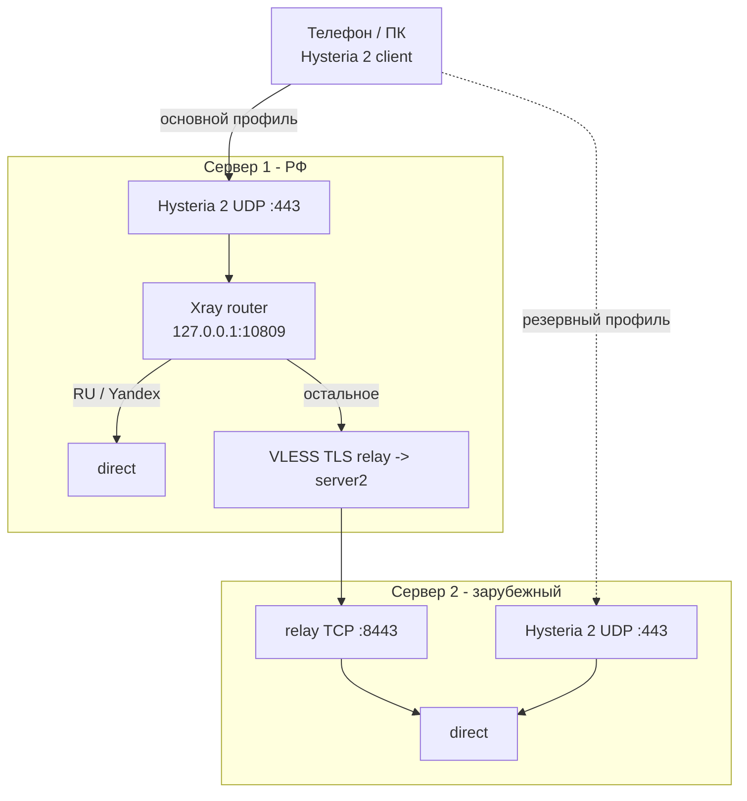

# VPN-Hysteria2 Dual: два сервера, split по РФ

Схема «сервер 1 в РФ + сервер 2 за рубежом» теперь использует **Hysteria 2** для клиентских подключений.

| Подключение | Куда подключается клиент | Куда уходит трафик |
|-------------|--------------------------|-------------------|
| **Основной** | Сервер 1 по Hysteria 2 | `geoip:ru` / `geosite:category-ru` / `geosite:yandex` напрямую; остальное через сервер 2 |
| **Резерв** | Сервер 2 по Hysteria 2 | Весь трафик через зарубежный VPS |

Между серверами используется внутренний **VLESS + TLS relay** на TCP 8443. Это не клиентский протокол, а транспорт для связи server1 -> server2.

---

## Схема



---

## Требования

| Узел | Расположение | Софт | Порты |
|------|--------------|------|-------|
| **Сервер 2** | За рубежом | Чистый VPS или существующий VPN-XRAY для миграции | UDP 443 для клиентов, TCP 8443 для relay |
| **Сервер 1** | РФ или ближе к РФ | Чистый VPS | UDP 443 для клиентов |

Откройте порты и в панели хостинга, и в UFW. Для TCP 8443 на сервере 2 лучше разрешить доступ только с IP сервера 1.

---

## Быстрый Старт

### 1. Сервер 2

Новая установка на чистом зарубежном VPS:

```bash
git clone https://github.com/esovgirenko/hysteria.git
cd hysteria
chmod +x dual-server/install-server2.sh dual-server/lib/common.sh
sudo ./dual-server/install-server2.sh
```

Если сервер 2 уже был установлен старым `server/install-reality.sh`, можно мигрировать без удаления старого входа:

```bash
cd hysteria
chmod +x patch-server2.sh dual-server/lib/common.sh
sudo ./patch-server2.sh --server1-ip IP_СЕРВЕРА_1
```

Сервер 2 создаст два файла:

```text
/etc/hysteria/hysteria-client-params.json
/usr/local/etc/xray/relay-server1-params.json
```

Первый нужен для резервного профиля клиента, второй нужно передать на сервер 1.

### 2. Передать relay на сервер 1

На сервере 1:

```bash
sudo mkdir -p /usr/local/etc/xray
sudo cp relay-server1-params.json /usr/local/etc/xray/
sudo chmod 600 /usr/local/etc/xray/relay-server1-params.json
```

### 3. Сервер 1

```bash
cd hysteria
chmod +x install-server1.sh dual-server/lib/common.sh
sudo ./install-server1.sh -y
```

После установки основной клиентский профиль лежит здесь:

```text
/etc/hysteria/hysteria-client-params.json
```

### 4. Ссылки для клиента

На компьютере:

```bash
cd hysteria/client
./setup-venv.sh

cd ../dual-server/client
../../client/.venv/bin/python dual-link-gen.py \
  /path/to/server1-hysteria-client-params.json \
  /path/to/server2-hysteria-client-params.json
```

Импортируйте два профиля:

| Имя | Назначение |
|-----|------------|
| `VPN-Server1-RU-split` | Основной профиль |
| `VPN-Server2-Fallback` | Резерв, если сервер 1 недоступен |

---

## Скрипты

| Скрипт | Назначение |
|--------|------------|
| `install-server1.sh` | Сервер 1: Hysteria 2 + Xray split-routing + outbound на сервер 2 |
| `install-server2.sh` | Сервер 2: Hysteria 2 fallback + relay для сервера 1 |
| `patch-server2.sh` | Добавить Hysteria 2 и relay на существующий старый server2 |
| `export-client-params.sh` | Показать `/etc/hysteria/hysteria-client-params.json` |
| `export-relay-params.sh` | Восстановить `/usr/local/etc/xray/relay-server1-params.json` |
| `client/dual-link-gen.py` | Создать две `hysteria2://` ссылки |

### install-server1.sh

```bash
sudo ./install-server1.sh
sudo ./install-server1.sh --relay-file /usr/local/etc/xray/relay-server1-params.json -y
```

Переменные окружения:

```bash
CLIENT_PORT=443 XRAY_SOCKS_PORT=10809 sudo ./install-server1.sh -y
```

### install-server2.sh

```bash
sudo ./dual-server/install-server2.sh
```

Переменные окружения:

```bash
CLIENT_PORT=443 RELAY_PORT=8443 sudo ./dual-server/install-server2.sh
```

### patch-server2.sh

```bash
sudo ./patch-server2.sh --server1-ip 203.0.113.1
sudo ./patch-server2.sh --relay-port 8443 --hy2-port 443
```

Повторный запуск безопасен для relay: `relay-in` не дублируется. Hysteria client params при повторном запуске будут сгенерированы заново.

---

## Файлы На Серверах

| Файл | Сервер | Назначение |
|------|--------|------------|
| `/etc/hysteria/config.yaml` | 1, 2 | Конфиг Hysteria 2 |
| `/etc/hysteria/hysteria-client-params.json` | 1, 2 | Параметры для `hysteria-link-gen.py` |
| `/usr/local/etc/xray/config.json` | 1, 2 | Xray router/relay |
| `/usr/local/etc/xray/relay-server1-params.json` | 2 -> 1 | Параметры relay для server1 |

Файлы параметров создаются с `chmod 600`. Для скачивания через обычного пользователя скопируйте их в домашний каталог и поменяйте владельца.

---

## Проверка

На обоих серверах:

```bash
sudo systemctl status hysteria
sudo journalctl -u hysteria -n 50 --no-pager
```

В Dual-режиме:

```bash
sudo systemctl status xray
sudo XRAY_LOCATION_ASSET=/usr/local/etc/xray /usr/local/bin/xray run -test -config /usr/local/etc/xray/config.json
```

На сервере 2 проверьте firewall:

```bash
sudo ufw status numbered
```

Должно быть открыто:

- UDP 443 для Hysteria 2;
- TCP 8443 для relay, желательно только с IP сервера 1.

---

## Типичные Проблемы

| Симптом | Что проверить |
|---------|---------------|
| Клиент не подключается | Открыт именно UDP 443, а не только TCP 443 |
| Основной профиль подключается, зарубежные сайты не открываются | TCP 8443 с сервера 1 до сервера 2 |
| Нет `hysteria-client-params.json` | `sudo ./dual-server/export-client-params.sh` |
| Нет `relay-server1-params.json` | `sudo ./dual-server/export-relay-params.sh` на сервере 2 |
| После миграции старый REALITY ещё работает | Это нормально: `patch-server2.sh` его не удаляет |
