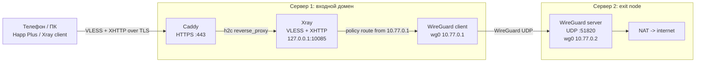

# Dual: VLESS + XHTTP на входе, WireGuard между серверами

Новая рекомендуемая схема:

| Участок | Протокол | Назначение |
|---------|----------|------------|
| Клиент -> Сервер 1 | VLESS + XHTTP + TLS + Caddy | Публичный вход под обычным доменом и HTTPS-сайтом |
| Сервер 1 -> Сервер 2 | WireGuard | Быстрый стабильный внутренний туннель |
| Сервер 2 -> интернет | NAT | Финальный выход в интернет |

Важно: абсолютной невидимости для DPI обещать нельзя. Лучший внешний вид получается, когда Сервер 1 имеет нормальный домен, валидный Let's Encrypt TLS и живую веб-страницу на `443/tcp`.

---

## Схема



---

## Требования

| Сервер | Что нужно | Порты |
|--------|-----------|-------|
| Сервер 1 | Домен с A/AAAA на IP сервера | `443/tcp`, `80/tcp`, `22/tcp` |
| Сервер 2 | Любой быстрый VPS для выхода | `51820/udp`, `22/tcp` |

На Сервере 1 домен обязателен: именно он даёт нормальный TLS и правдоподобный HTTPS-вход.

---

## Быстрый Старт

### 1. Сервер 2

Сначала установите WireGuard exit-node:

```bash
git clone https://github.com/esovgirenko/hysteria.git
cd hysteria
chmod +x dual-server/install-xhttp-wg-server2.sh
sudo ./dual-server/install-xhttp-wg-server2.sh
```

Скрипт создаст файл:

```text
/usr/local/etc/xray/xhttp-wg-server1-params.json
```

Передайте его на Сервер 1:

```bash
scp root@SERVER2_IP:/usr/local/etc/xray/xhttp-wg-server1-params.json .
scp xhttp-wg-server1-params.json root@SERVER1_IP:/usr/local/etc/xray/
```

Если используете обычного пользователя, скопируйте файл в домашний каталог, а затем на Сервере 1:

```bash
sudo mkdir -p /usr/local/etc/xray
sudo cp ~/xhttp-wg-server1-params.json /usr/local/etc/xray/
sudo chmod 600 /usr/local/etc/xray/xhttp-wg-server1-params.json
```

### 2. Сервер 1

Убедитесь, что домен уже указывает на Сервер 1:

```bash
dig +short your-domain.example
```

Затем установите входной VLESS + XHTTP и WireGuard-клиент:

```bash
git clone https://github.com/esovgirenko/hysteria.git
cd hysteria
chmod +x dual-server/install-xhttp-wg-server1.sh
sudo ./dual-server/install-xhttp-wg-server1.sh
```

Если на Сервере 1 уже работает приложение, например `aiagent` на `127.0.0.1:8000`, не меняйте порт `80` на `8000`. Оставьте `80/443` за Caddy и запустите установку так:

```bash
WEB_UPSTREAM=http://127.0.0.1:8000 sudo ./dual-server/install-xhttp-wg-server1.sh
```

Тогда обычные HTTPS-запросы к домену будут уходить в приложение, а скрытый XHTTP path останется маршрутом к Xray.

Скрипт спросит:

- домен Сервера 1;
- email для Let's Encrypt;
- скрытый XHTTP path, можно оставить авто.

Клиентские параметры будут здесь:

```text
/usr/local/etc/xray/vless-xhttp-client-params.json
```

---

## Клиентская Ссылка

Скачайте параметры с Сервера 1:

```bash
scp root@SERVER1_IP:/usr/local/etc/xray/vless-xhttp-client-params.json .
```

На компьютере:

```bash
cd hysteria/client
./setup-venv.sh
.venv/bin/python xhttp-link-gen.py /path/to/vless-xhttp-client-params.json --link --qr --text
```

Для Happ Plus:

- `Fingerprint`: `chrome`
- `TLS`: включён
- `Allow insecure`: выключен
- `SNI`: домен Сервера 1
- `Transport`: `xhttp`
- `Mode`: `packet-up`

В доменном режиме SHA-256 pin не нужен, потому что сертификат публичный от Let's Encrypt.

---

## Что Делают Скрипты

### `install-xhttp-wg-server2.sh`

- ставит WireGuard;
- создаёт ключи для Сервера 2 и Сервера 1;
- включает IP forwarding;
- включает BBR;
- настраивает NAT для сети `10.77.0.0/24`;
- открывает `51820/udp`;
- экспортирует параметры для Сервера 1.

### `install-xhttp-wg-server1.sh`

- ставит Xray, Caddy и WireGuard;
- настраивает `wg0`, но не меняет системный default route;
- добавляет policy routing только для источника `10.77.0.1`;
- настраивает Xray так, чтобы клиентский трафик выходил через Сервер 2;
- настраивает Caddy с доменом и Let's Encrypt;
- отключает HTTP/3 у Caddy, оставляя `h1` и `h2`;
- создаёт клиентский JSON для генератора VLESS-ссылки.

---

## Проверка

На Сервере 2:

```bash
sudo systemctl status wg-quick@wg0 --no-pager
sudo wg show wg0
sudo sysctl net.ipv4.ip_forward
```

На Сервере 1:

```bash
sudo systemctl status wg-quick@wg0 --no-pager
sudo systemctl status xray --no-pager
sudo systemctl status caddy --no-pager
sudo wg show wg0
ip rule | grep 10.77.0.1
curl -I https://YOUR_DOMAIN/
```

Проверить, что выходной IP стал IP Сервера 2:

```bash
curl --interface 10.77.0.1 https://api.ipify.org
```

Если команда показывает IP Сервера 2, WireGuard exit работает.

---

## Диагностика

| Симптом | Что проверить |
|---------|---------------|
| Сервер 1 не подключается к Серверу 2 | открыт ли `51820/udp` на Сервере 2 и в панели хостинга |
| `wg show` без handshake | совпадает ли `serverPublicKey`, не блокирует ли firewall UDP |
| Сайт не открывается | DNS домена, `sudo journalctl -u caddy -n 80 -l --no-pager` |
| Клиент подключается, но интернет не работает | `curl --interface 10.77.0.1 https://api.ipify.org` на Сервере 1 |
| После установки пропал SSH | эта схема не меняет default route; проверьте ручные изменения маршрутов вне скрипта |

---

## Старый Dual Вариант

Старые Hysteria 2 dual-скрипты оставлены в каталоге для совместимости:

- `install-server1.sh`
- `install-server2.sh`
- `patch-server2.sh`

Для новой схемы используйте именно:

```bash
sudo ./dual-server/install-xhttp-wg-server2.sh
sudo ./dual-server/install-xhttp-wg-server1.sh
```
